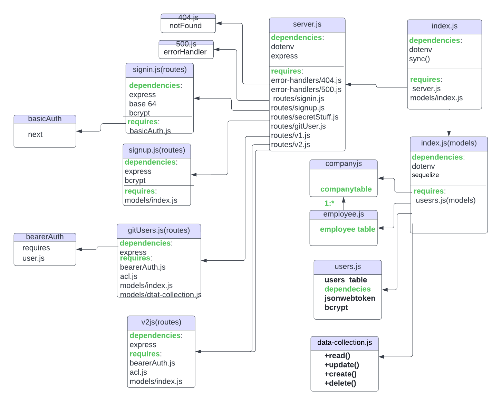

# **API-Authentication--System**
---

### **Heroku App**
🔗[Heroku App](https://api-auth-project.herokuapp.com/)
### **GitHub Action**
🔗[GitHub Actions](https://github.com/OmarSawalmeh/API-Authentication--System/actions)
### **Pull Requests**
🔗[pull requests](https://github.com/OmarSawalmeh/API-Authentication--System/pulls)

---

### **Summary work of the application**
- Build Server app with some Authentication, Bearer Authorization and ACL To check if the user had the authorized to give him the access, And add a ACL to create a role for each user and give him access regarding the role. 
- This will be our final project for the auth module.
- In this project, we are trying to imetite a blog website where we have different roles for each user:
    - User : who can only read articles.
    - Writer : who can read and write articles.
    - Editor : who can read, write and edit articles.
    - Admin : who can read, write, edit and delete articles.<br/>

We havecreated a server containg only the home rout which can be accessed by sending a get request to the endpoint("/").

---
## **Two main route file were created.**
## 1. The first one for the user routes which has the following definition:
- app.get('/getUsers', getUsersHandller) => this route is to list all users added to the Users table in the database.
- app.get('/signup', signupHandller) => this route will create arecord into the table using value passing as a object in body as a json format.
- app.get('/signin', basic(users) signinHandller) => this route, we are implementing the basic authorization and use the basicAuth middleware, what it dose is that it take the user name , search for the database a record with this user name, and then compare the entered password with the hashed password for this user name by using bcrypt.

## 2. The Second main route for the **Access Control List for each user** :
```js
- router.get('/:model/:id',bearerAuth,acl('read'), handleGetOne);
- router.post('/:model',bearerAuth,acl('create'), handleCreate);
- router.put('/:model/:id',bearerAuth,acl('update'), handleUpdate);
- router.delete('/:model/:id',bearerAuth,acl('delete'), handleDelete);
```
<br/>

### roles for each user acl('---'):
    - read : who can only read articles.
    - create : who can read and write articles.
    - update : who can read, write and edit articles.
    - delete : who can read, write, edit and delete articles.<br/>


### **UML Diagram**


---
